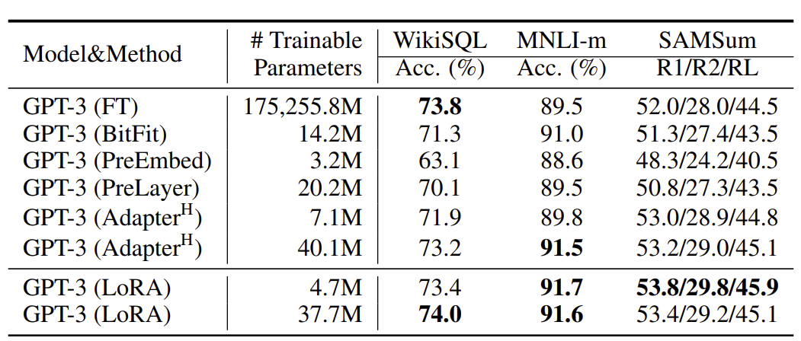
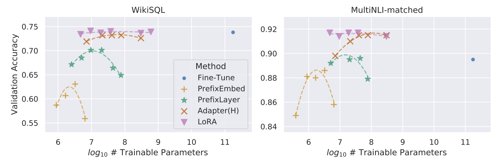

# WellnessMapDB

This project for pedestrians with disabilities to have wellness. <br/>

#### Test Environment

```
[ NVIDIA DGX Station Version 4.12.0 ]

OS : Ubuntu 18.04.6 LTS
CPU : Intel(R) Xeon(R) CPU E5-2698 v4 @ 2.20GHz (40 cores)
GPU : NVIDIA Tesla V100-DGXS-32GB (4 cards)
RAM : 256GB
```

### OUTLINE
- Parsing Roadview Image Data
- Reconstructing Roadview Image Data & Data labeling
- LLaVA (Large Language and Visual Assistant) fine-tuning
- Inference & Create Dataset

## Parsing Roadview Image Data


## Reconstructing Roadview Image Data & Data labeling


## LLaVA (Large Language and Visual Assistant) fine-tuning

By using LoRA, we can fine-tuning efficiently. <br/>





## Inference & Create Dataset

