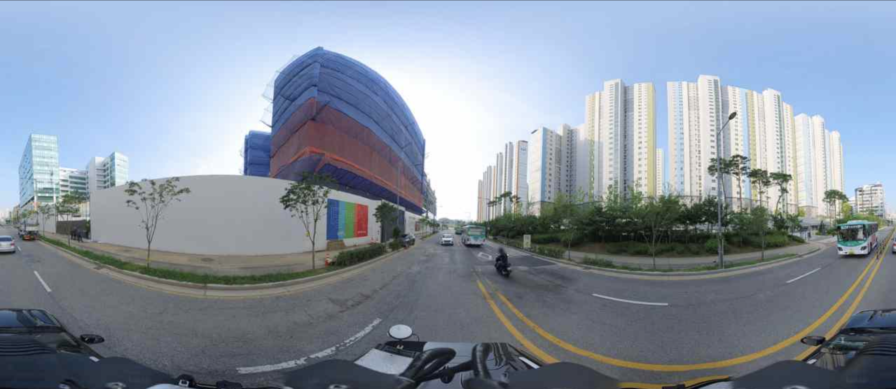
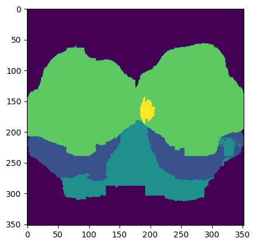
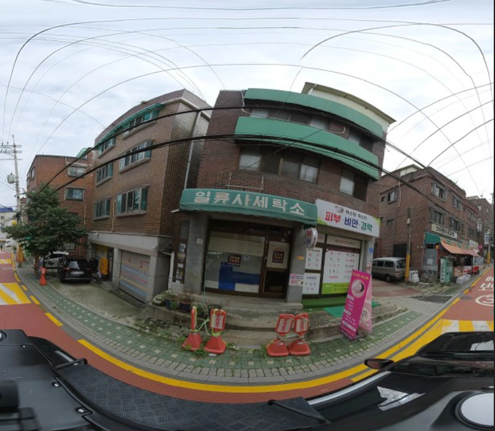

# WellnessMapDB

This project for pedestrians with disabilities to have wellness. <br/>

### Test Environment

```
[ NVIDIA DGX Station Version 4.12.0 ]

OS : Ubuntu 18.04.6 LTS
CPU : Intel(R) Xeon(R) CPU E5-2698 v4 @ 2.20GHz (40 cores)
GPU : NVIDIA Tesla V100-DGXS-32GB (4 cards)
RAM : 256GB
```

### OUTLINE
- [Parsing Roadview Image Data](#parsing-roadview-image-data)
- [Reconstructing Roadview Image Data & Data labeling](#reconstructing-roadview-image-data--data-labeling)
- [LLaVA fine-tuning](#llava-large-language-and-visual-assistant-fine-tuning)
- [Inference & Create Database](#inference--create-database)

<br/>

--------------------

<br/>

## Parsing Roadview Image Data




We got the roadview image data by using KakaoMap's API. <br/>

<br/><br/>

## Reconstructing Roadview Image Data & Data labeling

First, we use the CLIPSeg to get the segmentation map. <br/>


Then, we can get the segmentation map. <br/>



So, we can get the images that contain sidewalk segmentation. <br/>



But, this image has distortion. <br/>
So, this image isn't enough to use. So, we need to reconstructing. <br/><br/>


```python
import cv2
import numpy as np

camera_matrix = np.array([[fx, 0, cx],
                          [0, fy, cy],
                          [0, 0, 1]])
dist_coeffs = np.array([k1, k2, p1, p2, k3])

image = cv2.imread('img/ahalf.png')

new_camera_matrix, _ = cv2.getOptimalNewCameraMatrix(camera_matrix, dist_coeffs, image.shape[:2], 1)

undistorted_image = cv2.undistort(image, camera_matrix, dist_coeffs, None, new_camera_matrix)

cv2.imshow('Undistorted Image', undistorted_image)
cv2.waitKey(0)
cv2.destroyAllWindows()
```

<br/> <br/>


Finally, we can get the image that is reconstructed. <br/>


<br/><br/>

## LLaVA (Large Language and Visual Assistant) fine-tuning

By using LoRA, we can fine-tuning efficiently. <br/>


#### Install requirements

[check here](https://github.com/haotian-liu/LLaVA)

```
pip install --upgrade pip
pip install -e .
pip install -e ".[train]"
pip install flash-attn --no-build-isolation
git pull
pip install -e .
```


#### Set hyperparameters

```
#!/bin/bash

deepspeed llava/train/train_mem.py \
    --lora_enable True --lora_r 128 --lora_alpha 256 --mm_projector_lr 2e-5 \
    --deepspeed ./scripts/zero3.json \
    --model_name_or_path lmsys/vicuna-13b-v1.5 \
    --version v1 \
    --data_path ./playground/data/dataset.json \
    --image_folder ./playground/data/roadview_images \
    --vision_tower openai/clip-vit-large-patch14-336 \
    --pretrain_mm_mlp_adapter ./checkpoints/llava-v1.5-13b-pretrain/mm_projector.bin \
    --mm_projector_type mlp2x_gelu \
    --mm_vision_select_layer -2 \
    --mm_use_im_start_end False \
    --mm_use_im_patch_token False \
    --image_aspect_ratio pad \
    --group_by_modality_length True \
    --bf16 False \
    --output_dir ./checkpoints/llava-v1.5-13b-lora \
    --num_train_epochs 15 \
    --per_device_train_batch_size 16 \
    --per_device_eval_batch_size 4 \
    --gradient_accumulation_steps 1 \
    --evaluation_strategy "no" \
    --save_strategy "steps" \
    --save_steps 50000 \
    --save_total_limit 1 \
    --learning_rate 2e-4 \
    --weight_decay 0. \
    --warmup_ratio 0.03 \
    --lr_scheduler_type "cosine" \
    --logging_steps 1 \
    --tf32 False \
    --model_max_length 2048 \
    --gradient_checkpointing True \
    --dataloader_num_workers 4 \
    --lazy_preprocess True \
    --report_to wandb
```   

#### LoRA fine-tuning

```
sh scripts/v1_5/finetune_lora.sh
```

#### result


<br/><br/>


## Inference & Create Database

